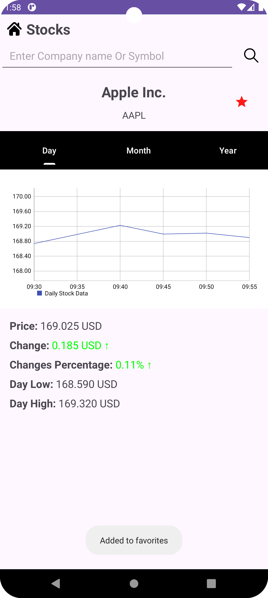

# MyStocks App

## Description
MyStocks is a Java Android application designed for tracking stock information.
 
With MyStocks, users can easily search for stocks by their name or symbol, mark their favorite stocks, and view real-time updates on their performance.
 
The application provides a user-friendly interface for monitoring stocks and offers graphical representations of their daily, monthly, and yearly performance trends.

## Features

- **Search Stocks**: Users can search for stocks either by name or symbol.
- **Favorite Stocks**: Users can mark certain stocks as favorites for quick access.
- **Real-time Updates**: Favorite stocks are updated every 30 seconds to provide the latest information.
- **Graphical Representation**: Stock performance is displayed graphically for daily, monthly, and yearly periods.

## Screenshots
<table>
  <tr>
    <td></td>
    <td></td>
  </tr>
  <tr>
    <td></td>
    <td></td>
    <td></td>
  </tr>
</table>

## Design Patterns Used

### 1. Singleton Pattern
The Singleton pattern ensures that a class has only one instance and provides a global point of access to that instance.

- In MyStocks, the FMPApiServiceSingleton class is responsible for making API requests to the Financial Modeling Prep (FMP) API.
- Using Singleton ensures that there's only one instance of this class throughout the application, optimizing resource usage and preventing unnecessary API connections.

### 2. Factory Pattern
The Factory pattern is used to create objects without specifying the exact class of object that will be created.

- In MyStocks, the FragmentFactory class serves as a factory for creating fragments based on the fragment type.
- This pattern is used to dynamically create fragments for displaying different types of stock performance graphs (e.g., daily, monthly, yearly).
- By using a factory, we decouple the fragment creation process from the caller, allowing for easier maintenance and scalability as new types of fragments can be added without modifying existing code.

### 3. Builder Pattern
The Builder pattern is used to construct complex objects step by step. It allows for the creation of different representations of an object using the same construction process.

- In MyStocks, we use the Builder pattern for constructing various data model objects such as DailyStockData, StockInfoDetails, and StockInfoSearch.
- This pattern is particularly useful when dealing with objects that have many optional parameters or complex initialization logic.
- By using builders, we can ensure that objects are constructed in a consistent and easy-to-read manner, while also allowing for future expansion of properties without changing the constructor signature.

## Installation
- Clone the repository to your local machine.
- Open the project in Android Studio.
- Build and run the application on an Android device or emulator.

## Usage
- Open the application.
- Search for stocks by name or symbol using the search functionality.
- Mark stocks as favorites by selecting the star icon.
- View favorite stocks on the main screen, which updates every 30 seconds.
- Tap on a favorite stock to view detailed information and graphical performance.
